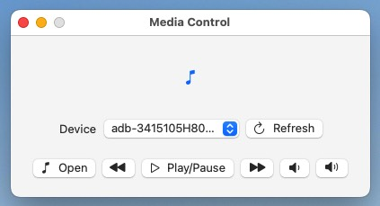

# Mac Apps

This is a list of applications that I developed for macOS to make my life easier. I hope you find them useful too.

## Media Control

This is a simple application that allows you to control the media playback of your Android device from your Mac. It uses the [Android Debug Bridge](https://developer.android.com/studio/command-line/adb) to send the media control commands to your device.

### Usage

Make sure that you have the Android Debug Bridge installed on your Mac. The default location of the ADB executable is `/Users/<username>/Library/Android/sdk/platform-tools/adb`.

Turn on the Developer Options on your Android device and enable USB Debugging. Connect your device to your Mac using a USB cable or over Wi-Fi.

Run the Media Control application and select your device from the list of connected devices. You can now control the media playback of your device using the buttons in the application.

Enjoy!

### Download

Download the latest version of the application from the [releases page](./downloads/Media%20Control.zip).

## License

MIT
